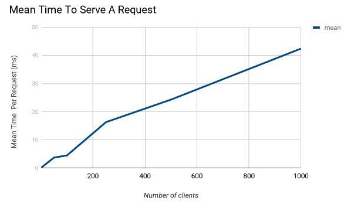
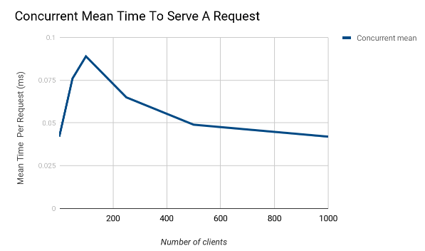

# Overview

1. Implementation of an HTTP server and client using TCP sockets in C++(Supports HTTP/1.0 & HTTP/1.1).
2. It supports get request(which sends to the client a file from the server) & post (From client to server).
3. It supports concurrent clients, persistent connections and timeouts.
4. It will write the file received URL path from the request upon reception of a response.
5. It supports the 200,400, & 404 response codes.
6. It only supports Content-Length upon reception of data in the body of request/response.
7. The client supports pipelining get requests to a certain limit.
8. It will work on JPG, HTML & TXT formats. Possibly, more.

---

# Command Arguments and file format.

### Client File
Method: can be 'GET' and 'POST'.
URL: the path to the file.
Hostname: the name of the server to send.
Port: optional input for the port number to contact the server on, the default port is 80.
```
<Method> <URL> <Hostname> <Port>
<Method> <URL> <Hostname> <Port>
.
.
.
<Method> <URL> <Hostname> <Port>
```
Example Client File Contents:
```
GET /a.html localhost 1025
GET /index.html localhost 1025
GET /pic_trulli.jpg localhost 1025
POST /test.txt localhost 1025
POST /paris.jpg localhost 1025
POST /test_folder/paris.jpg localhost 1025
```
### Client Command Line Arguments
Client arguments are redundant and are not needed, only needed like this due to assignment requirements conflict.
```
./Client <Server_IP> <Server_Port>
```
### Server Command Line Arguments
```
./Server <port_number_to_listen_on>
```
---
# Overall Organization:

## We have divided the project into six main folders
```
● parser:
○ responsible for parsing the file given to the client for requests.
● Client:
○ has the client logic (create sockets, establish connections, read and
send requests, get responses, pipelining).
● Server:
○ has the server logic (start server, update timeout, clean workers).
● File system:
○ has the file I/O logic.
● Web models:
○ has network enums, request and response classes along with a class
wrapping a request and it’s port number.
● Utils:
○ has util classes for string manipulations, and socket operations.
● Main:
○ has the main classes of client and server.
```

## Important Assumptions & Notes about the implementation:

**For Client:**
    1- using pipelining for GET requests only, on POST we send request and start
    receive all previous requests.
    2- we have a limit for pipeline to have  **20**  requests to send then we receive all
    requests.
    3- for each command we get host name and optional port number, we set 80
    for port number as default if there is no port number provided in command.
**For Server:**
    1- use threads instead of processes to handle client requests, since threads
    are faster to create, and share the memory with the original process.
    2- ask threads to terminate when reaching full capacity.
    3- server won’t serve post requests with no Content-Length header.
    4- timeout starts with 2 minute interval, reduces with each client.
    5- no busy wait, blocked wait until timeout or shutdown.

---
### Evaluation
Mean time to serve a request :

Mean time to serve requests with conccurency taken into account :



